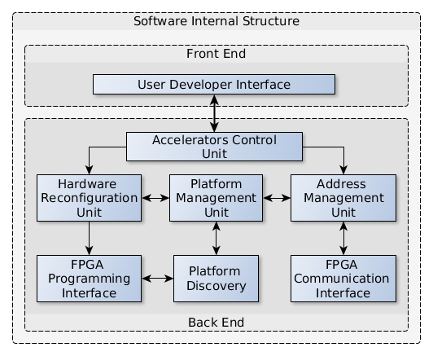

# LEOSoC

This repository contains the full source code of LEOSoC an open-source cross-platform embedded Linux library. LEOSoC reduces the development effort required to interface hardware accelerators with applications and making SoCs easy to use for an embedded software developer who is familiar with the semantics of standard POSIX threads. Using LEOSoC does not require any specific version of the Linux kernel, nor to rebuild a custom driver for each new kernel release. LEOSoC allows
the application to partially or completely change the structure of the HAs at runtime without rebooting the system by leveraging the underlying platforms’ support for dynamic full/partial FPGA reconfigurability.

[ Andrea Guerrieri, Sahand Kashani-Akhavan, Mikhail Asiatici, Paolo Ienne. 2019. Snap-On User-Space Manager for Dynamically Reconfigurable System-on-Chips. IEEE Access ]

Please cite that paper when using this library.

## Overview

LEOSoC supports FPGA Dynamic Full Reconfiguration (DFR) and Dynamic Partial Reconfiguration (DPR). The internal structure of the library is designed in order to
hide all the hardware structures needed to support the hardware accelerators
from the software developer’s workload. Figure shows the
internal structure of the library. Basically, the software library
is mainly composed of two parts: a front-end and a back-end.

  

## Requirements

An ARM cross compiler is required for compiling the code. The library has been tested on Terasic DE0nano and Xilinx ZC706. 

## Usage

The LEOSoC APIs provide the support to manage the hardware accelerators, thus the library is generic. The configuration of hardware accelerators is application dependent and not part of this library. For all questions please contact me at Andrea Guerrieri (firstname dot lastname at epfl dot ch | ieee dot org). 

### Compilation
To compile the library you can use the following command 

make CROSS_COMPILE=~/software/ARM/compiler/gcc-linaro-5.4.1-2017.05-x86_64_arm-linux-gnueabihf/bin/arm-linux-gnueabihf-

An example of compilation script is inlcuded in the repository. 

## License

## Contact
For all other questions and utilization support, please contact Andrea Guerrieri (firstname dot lastname at epfl dot ch | ieee dot org).
